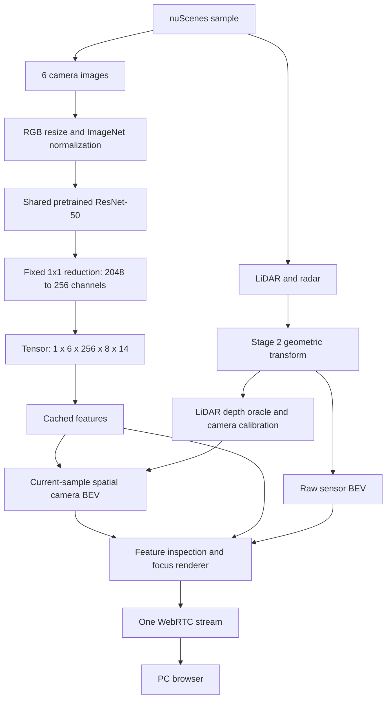

# nuScenes autonomy playback

Minimal Python + plain HTML WebRTC experiments for RunPod. Current scope is
Stage 4: current-sample camera spatial BEV using LiDAR-assisted depth for
geometry validation. No temporal memory, detection or learned sensor fusion.

- **Stage 1:** in-memory synthetic live video; [instructions](webrtc_test/README.md).
- **Stage 2:** nuScenes devkit sample playback with six cameras, LiDAR/radar
  geometric BEV, and Play/Pause/step/scene controls; [instructions](app/README.md).
- **Stage 3:** shared pretrained ResNet-50, cached feature tensors, mean/channel
  inspection, high-resolution focus panels and runtime metrics;
  [model, limitations and verification](app/STAGE3.md).
- **Stage 4:** image-space features + sparse LiDAR depth + resized intrinsics
  + camera extrinsics + each capture ego pose → metric **spatial BEV**.
  Output `[1,256,200,200]`, ±50m, 0.5m cells, +X forward / +Y left / +Z up.
  This contains **no temporal memory**. LiDAR is only a geometry/depth oracle;
  learned camera-only depth can be introduced later.

Stage 4 uses one nearest positive camera-Z depth per 32×32 image region,
lifting the region-centre ray with the existing capture-pose transforms.
This approximates the position of a coarse 8×14 descriptor; it is not exact
pixel geometry or the backbone receptive-field centre. It can be sparse and
misplace features near depth discontinuities. Moving-object time offsets are
not motion-compensated. No depth is filled into unsupported regions.
Contributions are averaged; gray cells have **no evidence**, not free space.
The tensor indexes increasing X then increasing Y; both axes flip for display.
All output is cached once per changed sample. Double-click **Camera Spatial
BEV**, Sensor BEV, a camera or the feature panel to inspect; Esc returns.

## Run Stage 4 on RunPod

```bash
cd /workspace/autonomy
# Use the RunPod Python that already has working torch and torchvision.
python -m venv --system-site-packages .venv-stage3
source .venv-stage3/bin/activate
pip install -r app/requirements.txt
export NUSCENES_DATAROOT=/workspace/data/nuscenes
export NUSCENES_VERSION=v1.0-mini
export TORCH_HOME=/workspace/.cache/torch
python app/server.py --stage 4
```

The default dataset root (when unset) is `/workspace/autonomy/datasets/nuscenes`.
Dataset files are not included. See the Stage 2 instructions for layout,
`v1.0-trainval`, timing limitations, coordinate conventions and verification.
Only one server can use port 8080; stop an existing server before launching.

Open your RunPod HTTP proxy endpoint for port 8080, select a scene, and press
Play. `/health` returns `{"status":"ok"}`. Media uses WebRTC; the HTTP proxy
carries the page and SDP signaling. Optional TURN settings are documented in
the Stage 1 instructions for networks where direct ICE connectivity fails.

Current browser URL: https://ikshk0dzrpwflf-8080.proxy.runpod.net/

For preserved Stage 2 without torch, use its `.venv-player` environment and
`python app/server.py --stage 2`. Stage 3 uses the pod's existing Python 3.12
PyTorch/CUDA stack; Stage 2's Python 3.11 environment remains separate.
Use `--stage 3` for image-space features only. Stage 4 adds no dependencies.
Verify geometry, output shapes, camera orientation, caching and decoded WebRTC:

```bash
NUSCENES_DATAROOT=/workspace/data/nuscenes python app/verify_stage4.py
```


